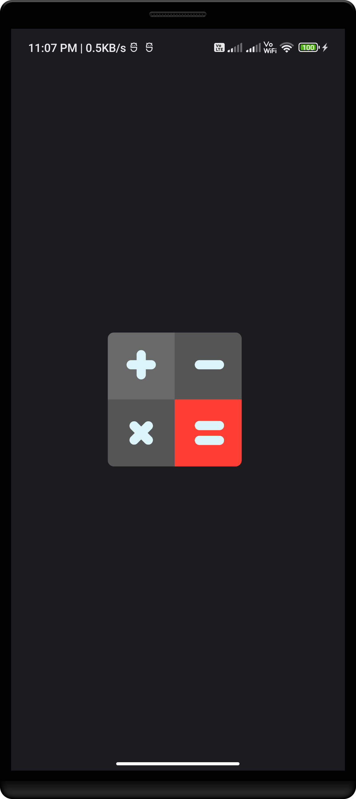
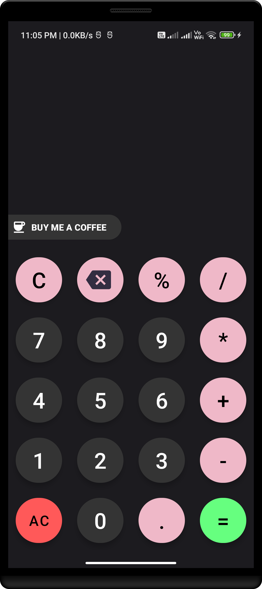
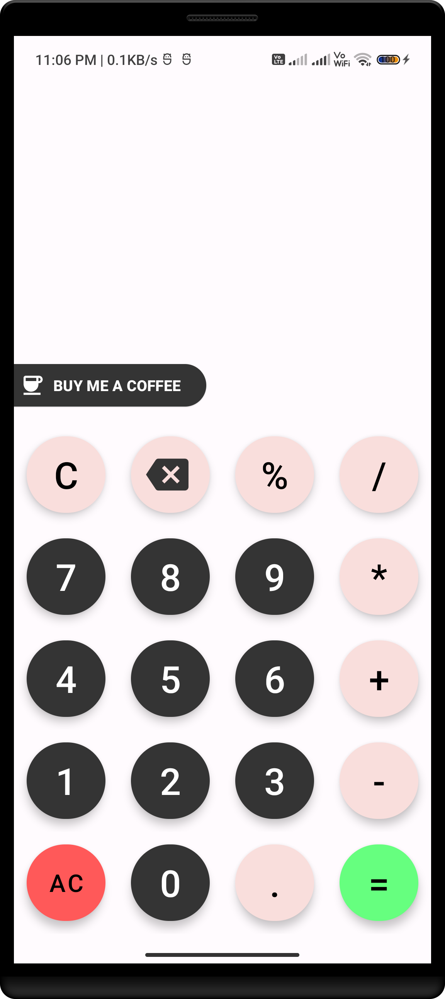

<!-- Title -->
<h1 align="center"> Calculator - App </h1><br>


<!-- Logo -->
<a href="#">
  
</a>
<br>


<!-- Social Section -->
<p align="center">
  <a href="https://www.linkedin.com/in/richu-antony-a12817200/">
    
  </a>&nbsp;
  <a href="richuantony38@gmail.com">
    
  </a>&nbsp;
   <a href="https://www.facebook.com/profile.php?id=100005766917977">
    
  </a>&nbsp;
  <a href="https://www.instagram.com/_richu._.antony_/">
    
  </a>&nbsp;
  <a href="https://discord.com/channels/1052108523422625893">
    
  </a>&nbsp;
  <a href="https://twitter.com/richu_antony">
    
  </a>&nbsp;
  <a href="#">
    
  </a>&nbsp;
  <a href="#">
    
  </a>&nbsp;
</p>
<br>


<!-- Git Status -->
<p align="center">
    <a href="#">
        
    </a>
    <a href="#">
        
    </a>
    <a href="#">
        
    </a>
    <a href="#">
        
    </a>
    <a href="#">
        
    </a>
    <a href="#">
        
    </a>
</p>


<!-- About -->
#
# 🌞About
<p align="justify">A calculating device An Android app is a piece of software that allows you to perform mathematical calculations on your Android device. It enables users to enter mathematical equations using a virtual keyboard and receive immediate results. Basic arithmetic operations such as addition, subtraction, multiplication, and division can be performed by calculator apps. Android calculator apps written in Kotlin can take advantage of the Android operating system's built-in calculator functionality. A history of previous calculations, the ability to save and recall calculations, and support for multiple themes and languages are all features that many calculator apps provide. Calculator apps have become an indispensable tool for many Android users, allowing them to perform calculations quickly and easily on the go without the need for a physical calculator.<br><br>"Programming is a creative outlet and art form. It is the procedure for bringing concepts to life and building something from scratch. The opportunities are infinite if you have the correct knowledge and equipment."</p>


<!-- How To Use -->
#
# 🪶How To Use
To clone and run this application, you'll need [Android Studio](https://developer.android.com/studio?gclid=Cj0KCQiA0oagBhDHARIsAI-BbgdFKz-5bSbmN5yQJcGrxrRsEV_DuwEOdFVh98HasUezD4n1JyUQf8gaAiQ_EALw_wcB&gclsrc=aw.ds) and [VS Code](https://code.visualstudio.com/) installed on your computer.

```bash
Step 1: 
# Clone this repository
$ https://github.com/Richu-Antony/Calculator_App.git

Step 2: 
# Paste the folder to "Android Studio" folder
Calculator

Step 3:
# Start Android Studio
Start Android Studio and open the required project

Step 4:
# Build the project
Selected Project
```


<!-- Screenshots -->
#
# 🌌 Screenshots
<div style="text-align: center;">
    &nbsp;
    &nbsp;
    &nbsp;
</div>


<!-- Support  -->
#
# ⚡ Support
<div align="center">
    <p>"Collaboration is the key to success in today's fast-paced digital world. By working together and leveraging each other's strengths, we can achieve great things and make a real impact."
    </p>
    <br>
    
    <a href="https://www.linkedin.com/in/richu-antony-a12817200/">
       
    </a>
    <br><br>
    <a href=""> 
        
    </a>&nbsp;
    <a href=""> 
        
    </a>
    <br><br>
    "Your support can make a real difference in the lives of those in need. Please consider donating today and join us in our mission to create a better world for all."
</div>